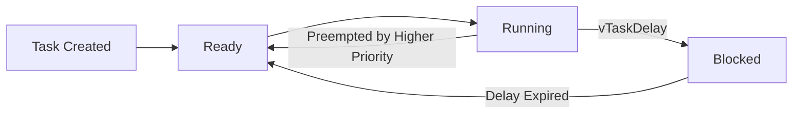
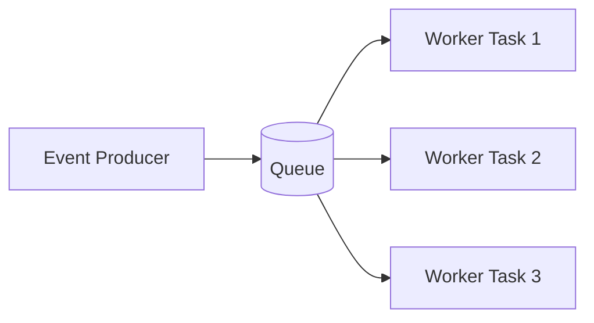
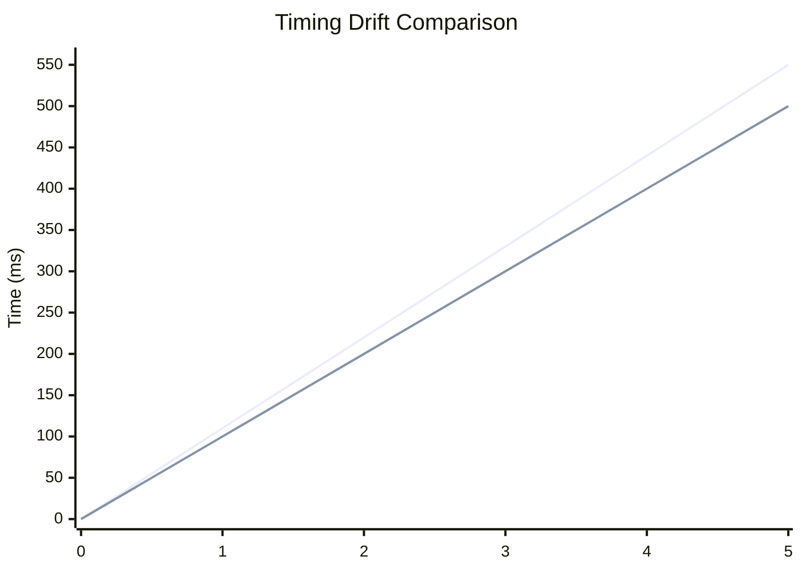
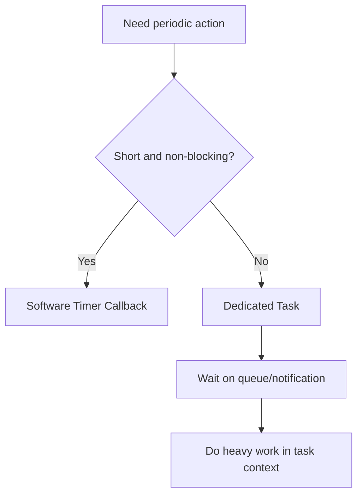

# FreeRTOS Master Notes (Version 2)

This is an expanded second version of your combined notes for Modules 1, 2, and 3.

---

## Quick Navigation

- [Module 1: Setup and First FreeRTOS Program](#module-1-setup-and-first-freertos-program)
- [Module 2: Multi-Task Design, Parameters, and Monitoring](#module-2-multi-task-design-parameters-and-monitoring)
- [Module 3: Precise Timing and Software Timers](#module-3-precise-timing-and-software-timers)
- [System Design Cheatsheet](#system-design-cheatsheet)
- [Interview and Revision Questions](#interview-and-revision-questions)
- [One-Page Exam Notes](#one-page-exam-notes)

---

## Module 1: Setup and First FreeRTOS Program

### 1. Objective

In this module you learned how to bring up FreeRTOS on STM32 and verify real multitasking with two independent tasks.

### 2. Hardware and Tools

- Board: STM32 Nucleo-F446RE
- Config tool: STM32CubeMX
- IDE/debugger: Keil uVision
- RTOS layer: FreeRTOS via CMSIS V2

### 3. Critical Configuration Choices

- SysTick is reserved for FreeRTOS scheduler tick.
- HAL timebase is moved to TIM6.
- Tick rate is typically set to 1000 Hz for 1 ms resolution.
- Stack overflow checks should be enabled.
- Heap size must be realistic for number of tasks plus middleware.

### 4. First Program Structure

You created at least two tasks:

- LED task: toggles LD2 periodically.
- UART print task: prints a counter and status message.

Both tasks should run forever and use RTOS delay APIs.

### 5. Scheduling Mental Model

### 6. Major Mistakes to Avoid

- Using HAL_Delay inside task loops.
- Returning from task functions accidentally.
- Ignoring xTaskCreate return values.
- Assigning unsafe ISR priorities for RTOS APIs.
- Underestimating stack requirement.

### 7. Outcome of Module 1

You reached a stable baseline where multitasking, delays, and UART logging all work without blocking the CPU.

---

## Module 2: Multi-Task Design, Parameters, and Monitoring

### 1. Objective

This module focused on designing a small multi-task application with proper priority planning and runtime visibility.

### 2. Typical Task Set in This Module

- ButtonTask (high priority): captures user input quickly.
- SensorTask (medium): periodic data sampling.
- LEDTask (medium): status feedback.
- DisplayTask (low): UART diagnostics/log output.

### 3. Priority Rules You Practiced

- Higher priority ready task preempts lower priority tasks.
- Lower priority tasks still run when high priority tasks block.
- Priority is about timing criticality, not code importance.

### 4. Parameter Passing Patterns

Safe methods:

- Pass pointer to static/global config struct.
- Use pre-allocated array of task configs.
- Pass constant integer values only when cast usage is intentional and safe.

Unsafe method:

- Passing address of local variable that goes out of scope.

### 5. Monitoring APIs and Why They Matter

- uxTaskGetStackHighWaterMark: checks worst-case stack margin.
- xPortGetFreeHeapSize: current free heap.
- xPortGetMinimumEverFreeHeapSize: minimum free heap seen so far.
- vTaskList: snapshot of task state, priority, and stack metrics.

### 6. Better Architecture Pattern

Avoid creating unlimited short-lived tasks. Prefer fixed worker tasks and queues.

### 7. Common Mistakes in Module 2

- Too many dynamic task creations.
- Busy loops with no blocking calls.
- No telemetry for stack and heap.
- Wrong priority distribution leading to starvation.

### 8. Outcome of Module 2

You can now design a scalable RTOS application with measurable health and predictable task behavior.

---

## Module 3: Precise Timing and Software Timers

### 1. Objective

This module taught deterministic periodic execution and the correct usage of software timers.

### 2. vTaskDelay vs vTaskDelayUntil

vTaskDelay:

- Relative delay from now.
- Loop period becomes work time plus delay.
- Drift accumulates.

vTaskDelayUntil:

- Absolute scheduling against previous wake time.
- Maintains fixed period.
- Best for control loops and periodic sampling.

### 3. Drift Comparison

If your chart renderer does not support xychart-beta, use this conceptual table:

| Cycle | Expected (ms) | vTaskDelay (ms) | vTaskDelayUntil (ms) |
|---|---:|---:|---:|
| 0 | 0 | 0 | 0 |
| 1 | 100 | 110 | 100 |
| 2 | 200 | 220 | 200 |
| 3 | 300 | 330 | 300 |
| 4 | 400 | 440 | 400 |
| 5 | 500 | 550 | 500 |

### 4. Software Timers

Two types:

- One-shot timer: runs once.
- Auto-reload timer: periodic callback.

Rules for callbacks:

- Keep callback very short.
- Do not block.
- Do not do heavy processing.
- Signal a task for heavy work.

### 5. Choosing Task vs Timer

### 6. Precision Tools

- Tick timestamp logging for expected vs actual wake times.
- DWT cycle counter for CPU-cycle-level profiling.
- Deadline miss counters for runtime confidence.

### 7. Common Mistakes in Module 3

- Forgetting to initialize last wake tick before vTaskDelayUntil.
- Blocking inside timer callbacks.
- Using vTaskDelay for precise periodic control loops.
- Assuming sub-tick precision without hardware timer techniques.

### 8. Outcome of Module 3

You can design periodic loops with low drift and decide correctly between software timers and dedicated tasks.

---

## System Design Cheatsheet

### A. Golden Rules

1. Never block high-priority tasks unnecessarily.
2. Every task should block, delay, or wait on events frequently.
3. Keep interrupt handlers short and defer work to tasks.
4. Keep timer callbacks tiny and non-blocking.
5. Measure stack and heap; do not guess.
6. Use vTaskDelayUntil for fixed-rate real-time loops.
7. Use queue/notification-based design instead of ad-hoc globals.

### B. Minimal Stable Startup Checklist

- Clock and pins configured.
- UART log is alive.
- Scheduler starts successfully.
- Idle task is running.
- At least one user task toggles observable output.
- Stack overflow hook is configured.
- Heap minimum margin is recorded.

### C. Debug Checklist for Random Crashes

- Check stack high-water marks.
- Increase stack for suspected tasks.
- Verify ISR priorities against FreeRTOS limits.
- Check for blocking calls in forbidden contexts.
- Review dynamic memory use and fragmentation patterns.

---

## Interview and Revision Questions

### Module 1 Questions

1. Why should SysTick generally be reserved for FreeRTOS instead of HAL?
2. What happens if a task function returns?
3. Why is HAL_Delay harmful inside task loops?
4. How does priority influence which task runs?
5. Why must xTaskCreate return value be checked?

### Module 2 Questions

1. When can a lower-priority task still run in a preemptive scheduler?
2. Why is passing a pointer to a local variable unsafe for task parameters?
3. What does stack high-water mark actually tell you?
4. Why is minimum-ever-free-heap more useful than current free heap?
5. Why is fixed worker pool plus queue better than uncontrolled task spawning?

### Module 3 Questions

1. Why does vTaskDelay accumulate drift?
2. What problem does vTaskDelayUntil solve mathematically?
3. Why should software timer callbacks not block?
4. When should you replace a timer callback with a dedicated task?
5. How can you prove that a periodic task is missing deadlines?

---

## One-Page Exam Notes

- FreeRTOS task states: Ready, Running, Blocked, Suspended.
- Scheduler selects highest-priority Ready task.
- vTaskDelay: relative, easy, drift-prone.
- vTaskDelayUntil: absolute period, drift-resistant.
- Use queue/notification for communication and synchronization.
- Stack failures are common first cause of random faults.
- ISR-to-task handoff should be short and deterministic.
- Timer callback is not a mini task; keep it tiny.
- Measure timing and memory continuously.
- Determinism is a design outcome, not an assumption.

---

## Suggested Next Pages for Your notes Folder

You can split this master page later into:

- Freertos_Architecture.md
- FreeRTOS_Debugging_Checklist.md
- FreeRTOS_Interview_QA.md
- FreeRTOS_Timing_Deep_Dive.md

This Freertos.md can remain your central entry page.
